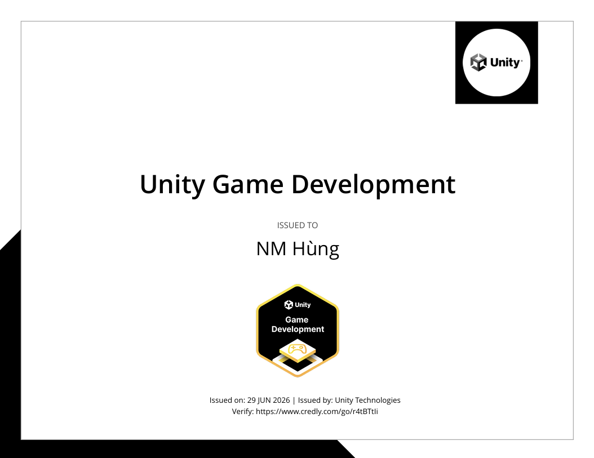

**Unity Game Development Badge**

This repository contains projects and exercises completed as part of the Unity Learn "Game Development" pathway (badge).

- **Badge:** Unity Learn — Game Development
- **Pathway link:** https://learn.unity.com/pathway/game-development?version=6.3

What I learned
- Fundamentals of Unity Editor and project setup
- Scene creation, lighting, and environment building
- Player movement, input handling, and character controllers
- Physics, collisions, and simple gameplay mechanics
- UI creation with TextMesh Pro and basic HUD elements
- Animation basics and animator controller usage
- Asset management, importing, and prefabs
- Scripting in C# for game logic and interactivity

 </img>
**Badge link:** https://www.credly.com/badges/c0ce90ea-fa3a-45bb-b4e7-a621ff3fd172/public_url

[BadgeLink]()